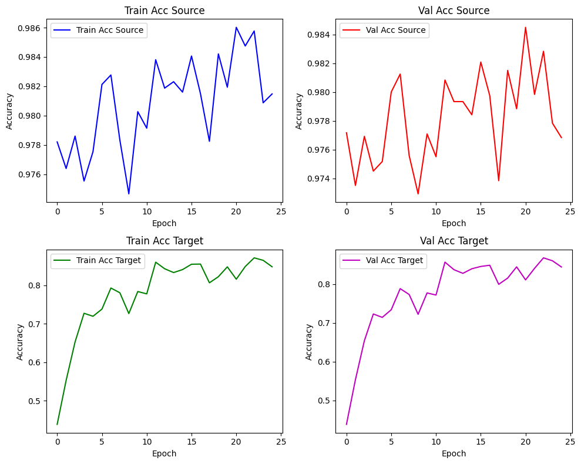

# Adversarial_Discriminative_Domain_Adaptation
This repository implements the **Domain-Adversarial Neural Network (DANN)** approach for unsupervised domain adaptation using MNIST as the source domain and MNIST-M as the target domain.

## 🧠 Idea
**Adversarial Discriminative Domain Adaptation (ADDA)** uses a feature extractor trained with a label classifier and a domain classifier in an adversarial setup. A **gradient reversal layer** is introduced to invert gradients from the domain classifier, encouraging the feature extractor to produce domain-agnostic representations.

## 📁 Project Structure

```
.
├── Adversarial_Discriminative_Domain_Adaptation.ipynb  # Full training pipeline
├── dataset/
│   ├── MNIST/                                       # Source domain data
│   └── mnist_m/                                     # Target domain data
│       ├── mnist_m_train/                           # Images
│       └── mnist_m_train_labels.txt                 # Label file
├── models/
│   └── best_model.pth                               # Saved best-performing model

```

## 📌 Features
- Gradient reversal layer for domain adaptation.
- Custom dataset loader for mnist_m.
- Train-validation split for both domains.
- Accuracy tracking on both source and target datasets.
- Accuracy visualization over training epochs.

## 🚀 How to Run
Use google colab or any notebook to run script Adversarial_Discriminative_Domain_Adaptation.ipynb

## 🧪 Dataset Info
- Source: [MNIST](http://yann.lecun.com/exdb/mnist/)
- TARGET: [MNIST-m](https://paperswithcode.com/dataset/mnist-m) - requires preprocessing and label file mnist_m_train_labels.txt

## 🏗️ Model Architecture
- Feature Extractor: 2 Conv + Pool layers with BatchNorm and ReLU.
- Label Classifier: 3-layer MLP with Dropout and LogSoftmax.
- Domain Classifier: 2-layer MLP with gradient reversal layer.

## 📉 Visualization



## 💡 References
[Yaroslav Ganin and Victor Lempitsky. "Unsupervised Domain Adaptation by Backpropagation", ICML 2015.](https://arxiv.org/abs/1409.7495)